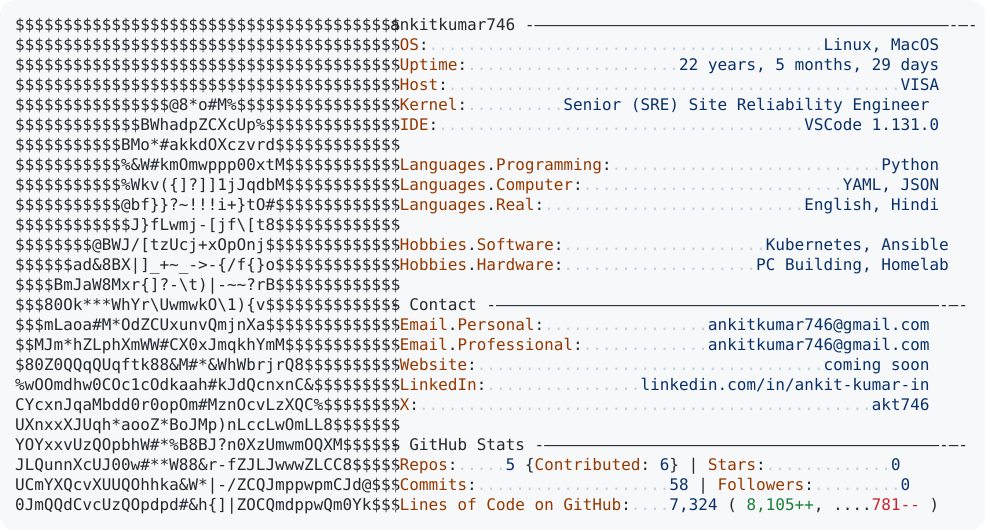

<h1 align="center">Hi, I'm Ankit 👋</h1>

  Infra Engineer — I don't marry a stack, I marry the problem.

  <picture>
    <source media="(prefers-color-scheme: dark)" srcset="dark_mode.svg">
    
  </picture>

---

### 🧭 What I actually do

I'm infra-agnostic by design. Cloud, bare metal, hybrid — doesn't matter, I learn the stack, understand where it breaks, and help design / implement / harden it.

### 🎯 Where I'm headed

Moving deeper into **AI infra** — workload scheduling, GPU/compute optimisation, and the platform layer that sits under model training & serving.

### 🛠️ What I've worked on

- Security hardening and policy enforcement across production Kubernetes clusters
- Built and scaled a high-throughput logging pipeline handling multi-TB/day volumes with sub-minute latency
- Ran hybrid clusters across bare metal and cloud, with custom provisioning pipelines (Terraform → iPXE → Ansible)
- Cut infra and observability costs through FinOps practices and platform migrations

### 📫 Reach me

[LinkedIn](https://linkedin.com/in/ankit-kumar-in) · [GitHub](https://github.com/ankitkumar746) · ankitkumarakt746@gmail.com